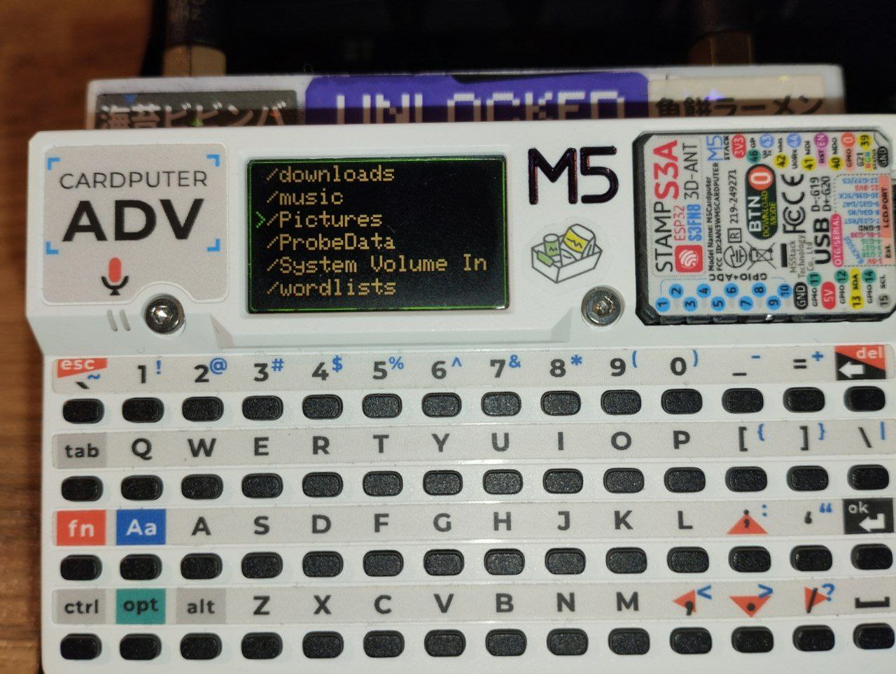

# 📸 Gallery for M5Stack Cardputer ADV

Turn your M5Stack Cardputer into a lightweight photo viewer.

---

## 📺 Demo


---

## ✨ Features
- Simple Setup: No complex configuration needed.
- SD Card Support: Loads images from a specific folder.
- Optimized for Cardputer: Tailored for the device's display.

---

## 🚀 How to Use

### 1. Prepare your SD Card
- Create a folder named "Pictures" in the root directory.
- Copy your images.jpg into this folder.
```
-Image Requirements:
    Format: Must be in .jpg extension.
    Resolution: Optimized for 240 x 135 pixels (16:9 aspect ratio) to match the Cardputer screen.
    Note: Larger images might work, but they have not been tested yet.
```
> Directory Structure Preview:


```
SD Card Root
└── 📁 Pictures
    ├── photo1.jpg
    └── summer2009.jpg
```
> **ℹ️ Test Images:**
> In the **Releases** section, you can find a `Picture.zip` archive with sample images.
> Just extract its contents into your `/Pictures` folder to quickly test the app.
### 2. Launch the App
- Insert the SD card into your Cardputer.
- Open the Gallery app and start viewing!

## ⌨️ Controls
```
 <   >   — Next or Previous image
 [   ]    — Skip 10 images Forward or Backward
 ʌ   v   — Adjust Display Brightness
   i     — Show Navigation Help (On-screen info)
```
---

## 🛠 Installation
1. Download the latest .bin file from the releases page.

2. Flash it to your M5Stack Cardputer using M5Burner or through m5launcher - OTA, by searching for Gallery_for_cardputer_ADV - author: @Frontendency
---
👨‍💻 Contacts:
Developer Telegram: @CardpadADV

Github: @FronTendency

Donations:
